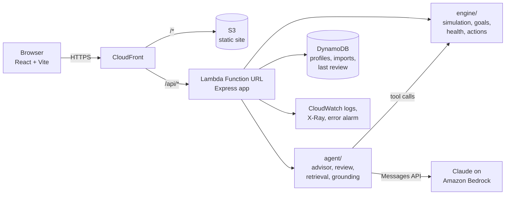
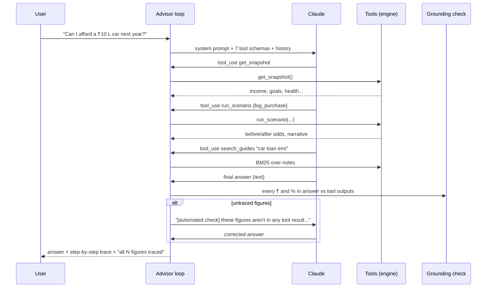

# Architecture

## The short version

Kosh is one React app talking to one API. The API is an Express app that runs unchanged on a laptop, in Docker, and inside AWS Lambda. Inside it there are two halves that we kept strictly apart:

- **engine/** - deterministic maths. Given a profile, assumptions and a scenario, it returns the same numbers every time. No network, no model.
- **agent/** - everything that decides *which* maths to run and *how to say it*: the advisor's tool loop, the offline planner, the monthly review pipeline, retrieval, and the grounding check.

The model (Claude on Bedrock or the Claude API) sits entirely inside `agent/`, and can only touch the engine through seven tools.

## AWS pieces and why

| Service | Used for | Why this and not something else |
|---|---|---|
| **Lambda** (Node 22, arm64) | The whole API | One function keeps cold starts and deploys simple. Everything is CPU-bound maths that finishes in well under a second, except advisor turns. |
| **Lambda Function URL** | HTTP entry point | Advisor turns with several tool calls can pass 30s; API Gateway's integration timeout is 30s. |
| **CloudFront** | Serves the app and routes `/api/*` to the function | Same origin for UI and API (no CORS dance), HTTPS, caching for hashed assets. |
| **S3** (private, OAC) | Built React app | Standard. |
| **DynamoDB** (on-demand, TTL) | Custom profiles, imported statements, last review snapshot (for "since last month" drift) | Key-value access only, zero idle cost. Items expire after 30 days. |
| **Amazon Bedrock** | Claude, for the advisor and the review writer | Keeps data in the AWS account; IAM instead of API keys. |
| **CloudWatch / X-Ray** | Logs, traces, an alarm on Lambda errors | Enough to debug a live demo. |

Infrastructure is one SAM template: [`infra/template.yaml`](../infra/template.yaml).

## The engine

### Household model

A profile is income, categorised monthly expenses, SIPs, EPF contributions, holdings by bucket (savings account, FDs, equity funds, EPF, PPF, NPS, gold, property…), loans, insurance, dependents, risk profile, and goals with a priority.

`summarize()` turns that into the numbers everything else uses: surplus, savings rate, emergency runway, asset mix, net worth.

### Goals: bucket planning + Monte Carlo

This is the core of the "am I on track" answer. The order is what we explain to users on the Goals page:

1. Keep the emergency reserve aside (6 months of expenses + EMIs, from cash first, then FDs). It is never goal money.
2. EPF/PPF/NPS only count toward retirement.
3. Remaining savings are earmarked to the nearest goals first - enough for ~85% odds, not just the average case.
4. The monthly SIP is shared across goals by what each still needs, weighted by priority (must-have 1.0, important 0.8, nice-to-have 0.5). A 25-year retirement can't starve a down payment due in 6.
5. Leftover SIP and all EPF contributions go to retirement.

Each goal is then simulated as **two streams** sharing the same monthly market shocks: money already earmarked (growing at the mix it's *actually* in) and new monthly money (growing at a mix suited to the goal's horizon - no equity under 2 years, capped equity under 5, and so on). Probability = share of simulated paths that end above the inflated goal cost.

Why "prudent" returns: sizing a SIP on the expected return gives ~50% odds by construction. We size on roughly the lower-20th-percentile compounded return for that horizon, and tell users we plan for ~80%.

### Common random numbers

Every simulation is seeded from `hash(profileId, goalId)`. A baseline and a what-if run over identical market paths, so the difference between them is the change - not noise. It also makes the engine properly testable ("investing more never lowers any probability" is one of the tests).

### Household projection

A month-by-month cash-flow simulation of the whole household: salary grows, expenses inflate, EMIs amortise and stop, SIPs step up, goals get paid for when they fall due (so the chart dips at the house purchase), and a job loss drains cash before investments. Half of any *unplanned* surplus is assumed to leak into lifestyle - which is exactly why "automate your surplus" is a recommendation and not a no-op. Output is p10/p50/p90 net worth per year in today's rupees.

### Health score

Six pillars, round weights (20/20/15/15/20/10): emergency cushion, savings rate, debt load, insurance, goal readiness, and whether long-term money is actually invested. Each pillar is a simple linear curve between two thresholds and comes with a sentence explaining its score. Tap a pillar in the UI to read it.

### Next-best actions

Eleven generators look for specific situations (expensive debt, thin emergency fund, idle cash, unplanned surplus, no step-up, off-track goals, protection gaps, FD-heavy long-term money, rising discretionary spend, employer NPS). Each produces a candidate with *why / how / assumptions / confidence / effort*.

Then the important part: every candidate that can be expressed as a scenario is **applied to a copy of the profile and the whole plan is re-run**. The ranking score is the priority-weighted change in goal probabilities, plus health-score change, plus an urgency term for protection gaps (a missing term plan with two dependents outranks a slightly better SIP). The "impact" line on each card is the before/after from that simulation.

## The agent layer

### Advisor (chat)

- Manual tool-use loop (max 8 steps), parallel tool calls executed together.
- Tools: `get_snapshot`, `run_scenario`, `check_goal`, `next_best_actions`, `analyze_spending`, `search_guides`, `get_assumptions`.
- System prompt rules: every number from a tool, name the key assumption, categories not products, not a SEBI-registered adviser (said once, not on every line).
- `stop_reason: refusal` or any API error → the offline planner answers instead, and the trace says so.
- On the Claude API we send `fallbacks: "default"` so a declined request is retried server-side on the recommended model.

**Grounding check** (`agent/grounding.js`): extracts every ₹ amount (understands L and Cr) and percentage from the answer and looks for it in the numbers returned by that turn's tool calls, with rounding tolerance. Untraced figures trigger one repair round. The UI shows "all 9 figures traced" or lists the ones that weren't (usually a difference the model computed itself).

### Offline planner

Same tools, same numbers, no model. A small intent router (purchase, job loss, crash, save more, step-up, retirement age, raise, spending, goal check, concepts, next steps) parses amounts like "12 lakh", "₹5,000", "5k", "1.2 cr", runs a 2-4 step tool plan and fills a template. It exists so the demo never depends on conference Wi-Fi, and doubles as the fallback.

### Monthly review pipeline

A fixed multi-agent pipeline - each stage has one job and passes structured output to the next:

| Stage | Does |
|---|---|
| Intake | Checks the profile has what's needed; notes whether transactions are synthetic or imported |
| Spending analyst | Category trends, benchmark flags, subscription count |
| Goal planner | Re-runs every goal; compares with last review (DynamoDB) for drift |
| Risk officer | Stress tests: 6-month job loss, 30% crash, both at once |
| Strategist | Next-best actions, simulated and ranked |
| Compliance reviewer | Drops anything naming a product/company; checks each action has assumptions; labels low-confidence items |
| Writer | Claude writes the note from a facts JSON only (or a template offline) |
| Fact checker | Grounding check on the note; one repair attempt, then falls back to the verified template rather than ship an unverifiable number |

Maths stays deterministic; the model's job is only the last mile of language.

### Retrieval

Fifteen short, hand-written notes on Indian personal finance (emergency funds, term/health insurance, PPF/EPF/NPS, tax regimes, allocation by horizon, sequence risk, prepay vs invest...). BM25 with title/tag boosting. At this corpus size a vector store adds cost and nothing else; the swap to Bedrock Knowledge Bases is isolated in `search()`.

## Integrations

- **Bank statement import**: CSV upload (date/description/amount, or debit/credit columns, dd/mm/yyyy dates, quoted commas). Lines are categorised with merchant rules (Swiggy → food delivery, BESCOM → utilities, "EMI" → loan...). Imported transactions replace the synthetic ones everywhere - spending page, advisor, review.
- **Claude** via Bedrock (`@anthropic-ai/bedrock-sdk`) or the Claude API (`@anthropic-ai/sdk`), chosen by env vars.
- **DynamoDB** behind a 3-method store interface; an in-memory map locally.

## API

| Method | Path | |
|---|---|---|
| GET | `/api/health` | liveness, which advisor mode, which store |
| GET | `/api/meta` | personas, default assumptions with notes, lever definitions |
| POST | `/api/profiles` | onboarding form → profile |
| POST | `/api/profiles/:id/overview` | summary, health, goals, projection, top actions |
| POST | `/api/profiles/:id/simulate` | `{scenario}` → baseline, scenario, deltas, narrative |
| POST | `/api/profiles/:id/goals/:goalId/solve` | extra SIP or delay needed for a target probability |
| POST | `/api/profiles/:id/actions` | all ranked actions |
| POST | `/api/profiles/:id/spending` | categories, trends, flags, recent transactions |
| POST/DELETE | `/api/profiles/:id/transactions/import` | CSV in / reset |
| POST | `/api/profiles/:id/chat` | `{message, history}` → reply, trace, grounding |
| POST | `/api/profiles/:id/review` | runs the pipeline |

Every POST accepts `assumptions` overrides, which is how the Assumptions page re-runs everything.

## Performance

On a laptop: overview (goals + 600-path household projection + 9 simulated actions) ≈ 300-600 ms; a what-if ≈ 60-150 ms; the whole review pipeline ≈ 0.5 s offline. Lambda at 1 GB arm64 is in the same range after warm-up. Advisor turns with Claude are dominated by model latency (typically a few seconds for 2-4 tool calls).

## Security notes

- No real personal data; everything is synthetic, custom profiles expire in 30 days.
- The model only sees what the tools return for the current profile.
- Inputs are clamped (lever ranges, assumption bounds, message length, CSV size).
- Known gap for production: the Function URL is unauthenticated. The path is Cognito + IAM-auth Function URL behind CloudFront OAC.
