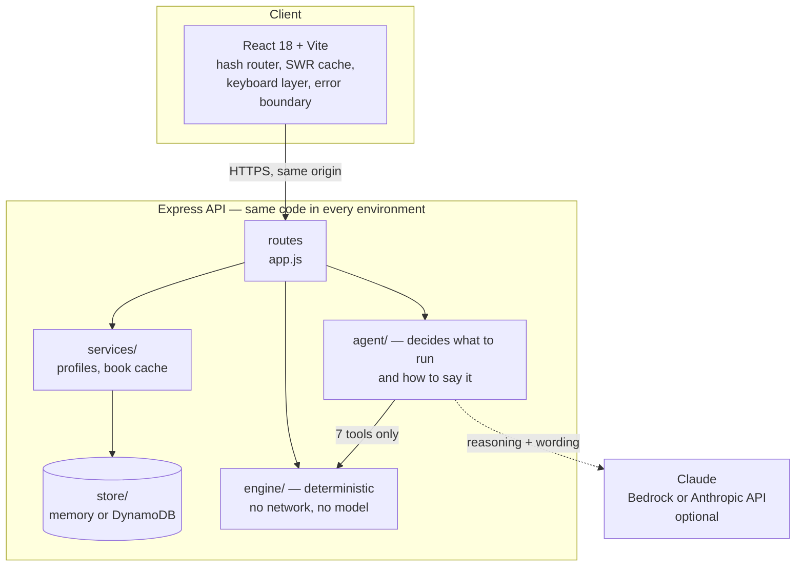
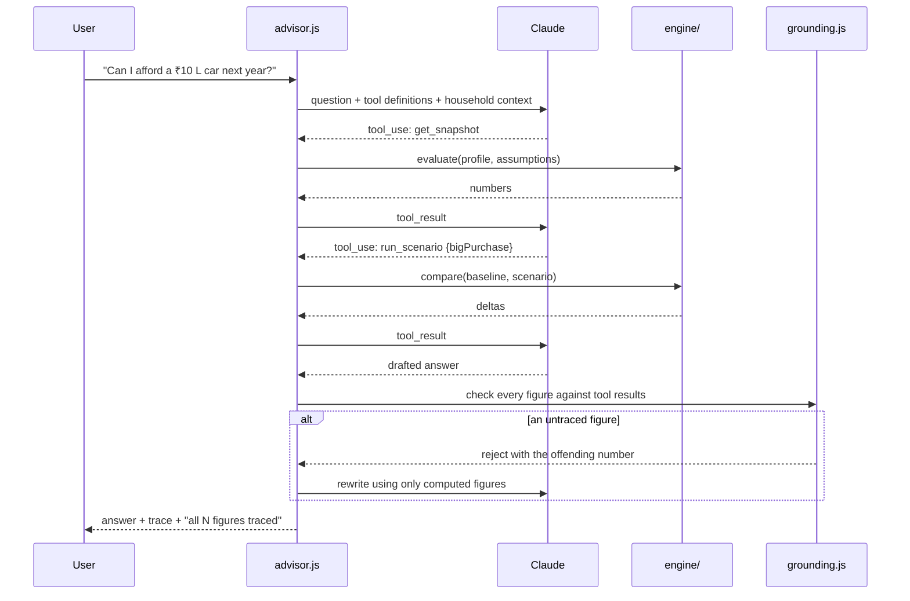
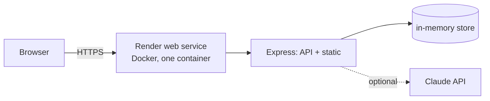
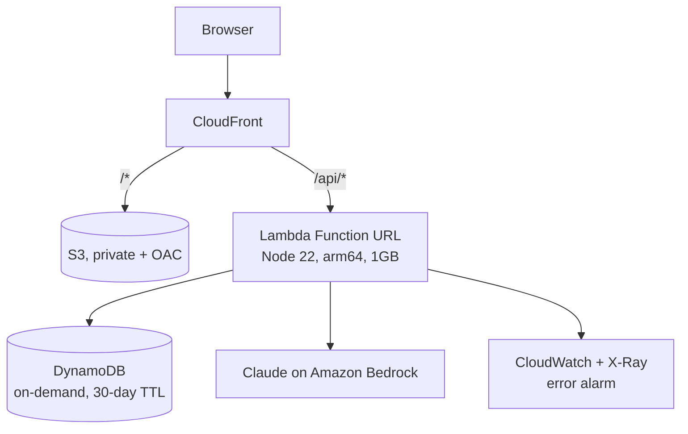

# Architecture

Kosh is an AI financial wellness platform: it takes a household's income, spending, assets,
debts, goals and risk preference, simulates hundreds of possible futures, and returns where
they stand, what happens if things change, and what to do next — with the reason behind
every number and every assumption on a page the user can edit.

This document covers how it is built and why it is built that way. It assumes you have read
the [README](../README.md).

**Contents**

1. [Design principles](#1-design-principles)
2. [System architecture](#2-system-architecture)
3. [Module boundaries](#3-module-boundaries)
4. [The engine](#4-the-engine)
5. [The agent layer](#5-the-agent-layer)
6. [Stretch: book surveillance](#6-stretch-book-surveillance)
7. [Stretch: suitability records](#7-stretch-suitability-records)
8. [Data flow and caching](#8-data-flow-and-caching)
9. [API surface](#9-api-surface)
10. [Deployment](#10-deployment)
11. [CI/CD](#11-cicd)
12. [Performance](#12-performance)
13. [Security and privacy](#13-security-and-privacy)
14. [Testing](#14-testing)
15. [Decisions and trade-offs](#15-decisions-and-trade-offs)
16. [Known limits](#16-known-limits)

---

## 1. Design principles

Four rules decided most of the structure. They are worth stating first because nearly every
design choice below follows from one of them.

**The model never does arithmetic.** Every number a user sees comes from deterministic code.
Claude decides *which* calculation to run and *how to explain the result*, and it reaches the
engine only through a fixed set of tools. A language model that is asked to compute a
retirement corpus will produce a confident, plausible, wrong number, and a financial planning
tool that does that is worse than no tool.

**Nothing is recommended that has not been simulated.** Each candidate action is applied to a
copy of the household and the entire plan is re-run. Ranking is by measured effect on that
household. There are no templated recommendations and no rules of the form "if age > 50 then
suggest X".

**Every figure is traceable.** A grounding checker extracts every rupee amount and percentage
from a generated answer and matches it against the tool results that produced it. An answer
containing a number the engine never computed is sent back to be rewritten before the user
sees it.

**Assumptions are a page, not a footnote.** Inflation, expected returns, volatility, the
emergency-fund target, how much unplanned surplus leaks away — all nineteen are listed with a
plain-language note, all editable, and changing one re-runs everything that depends on it.

---

## 2. System architecture

One React app talking to one API. The API is an Express application that runs unchanged on a
laptop, in a container, and inside AWS Lambda.



The dashed line to Claude is the only non-deterministic edge in the system, and it is
optional: with no model configured the advisor runs an offline planner that calls the same
tools and quotes the same engine numbers in plainer wording. Every other surface — goals,
simulations, health score, next-best actions, book screening, suitability records — is
deterministic and identical either way.

**Why one origin.** The container serves the built React app and the API from the same
process, so there is no CORS configuration, no second deployment target, and the frontend
calls `/api` with no base URL to get wrong.

---

## 3. Module boundaries

```
api/src/
  app.js            route definitions; the only place that knows about HTTP
  server.js         local/container entry point
  lambda.js         AWS Lambda entry point (same app, different adapter)

  engine/           deterministic maths — no I/O, no model, pure functions
    profile.js        household summary: income, mix, runway, net worth
    assumptions.js    the 19 assumptions, their notes and their bounds
    goals.js          goal planning, required SIP, Monte Carlo funding odds
    projection.js     net-worth fan chart, probability of running out
    health.js         six-pillar score
    actions.js        candidate actions, each simulated, then ranked
    scenario.js       what-if levers
    spending.js       transaction analysis and synthetic history
    analysis.js       evaluate() and compare() — the two entry points
    surveillance.js   stretch: book triage
    suitability.js    stretch: the record behind a recommendation
    rng.js            seeded RNG, common random numbers

  agent/            decides which maths to run and how to say it
    advisor.js        the tool loop
    tools.js          the 7 tools the model may call
    grounding.js      figure extraction and verification
    offline.js        the no-model planner
    review.js         the 8-stage monthly review
    retrieval.js      BM25 over the finance notes
    llm.js            provider selection: Bedrock, Anthropic API, or offline

  data/             personas, the generated book, finance notes
  services/         profile loading, book cache
  store/            key-value: in-memory locally, DynamoDB in Lambda
```

The boundary that matters is `engine/` ↔ `agent/`. The engine has no network calls, no
randomness that is not seeded, and no knowledge that a language model exists. That is what
makes it testable: 41 tests assert properties of it directly, with no mocking.

---

## 4. The engine

### 4.1 Household model

`summarize(profile)` reduces a household to the figures everything else needs: monthly income
including amortised bonus, total expenses, EMIs, SIPs, EPF, surplus, savings rate, net worth,
financial assets, emergency runway, and the asset mix expressed as equity / debt / gold / cash.

Asset classification matters more than it looks. EPF and PPF are mapped to *debt* because
that is what they behave like — but they are also statutory and locked, which is why the
suitability check in §6 measures allocation drift on the discretionary portfolio only.

### 4.2 Goals: bucket planning, then Monte Carlo

Goals are planned as separate buckets rather than against one pooled portfolio.

1. An emergency reserve is set aside first and never counted towards a goal.
2. Existing savings are earmarked to goals nearest first, so a goal three years away is not
   funded with money that only exists on paper for a goal twenty years out.
3. Each goal's cost is inflated to its own date (education uses its own higher inflation).
4. Money already earmarked keeps the mix it is actually invested in. Only *new* contributions
   follow the goal's ideal mix for its horizon.
5. Each goal is simulated: 800 market paths, returns drawn as log-normal from the assumed
   return and volatility for its mix, and the funding probability is the share of paths that
   reach the target by the date.

Point 4 is why "move fixed deposits into equity" shows up as a measurable improvement for an
FD-heavy saver and does nothing for someone already in equity — a pooled model would show the
same generic advice to both.

**Planning to odds, not to the average.** Required contributions are sized on a *prudent*
return — roughly a one-standard-deviation-poor outcome — rather than the expected return.
Planning on the average gives a coin flip; the UI says which line it is planning to.

### 4.3 Common random numbers

Baseline and scenario are evaluated against the *same* simulated markets, by seeding the RNG
per goal and per run identically.

Without this, "save ₹2,000 more a month" can come back worse than the baseline purely because
the two runs drew different markets, and the user is shown noise as if it were signal. It is
a standard variance-reduction technique and it is the single most important correctness
detail in the simulation.

### 4.4 Projection

A year-by-year net-worth fan chart in today's rupees: p10 / p50 / p90 across paths, with goal
payouts drawn where they land, plus the probability of running out of money entirely.

### 4.5 Health score

Six pillars — emergency cushion, savings rate, debt load, insurance, goal readiness, money
working for you — each scored out of its own weight, each able to explain how it was scored.
The score is the sum; no pillar is hidden.

### 4.6 Next-best actions

Eleven candidate actions are considered. Each one that can be simulated is applied to a copy
of the profile and the whole plan re-run; ranking is by what actually moved. Every action
carries **why** (with the household's own numbers), **how** (concrete steps), **assuming**
(its caveats) and a confidence level.

The rejected candidates are not discarded — see §7.

---

## 5. The agent layer

### 5.1 Advisor tool loop



Seven tools: `get_snapshot`, `run_scenario`, `check_goal`, `solve_for_goal`,
`analyze_spending`, `list_actions`, `search_notes`. The model cannot reach anything else.

All three of them run the same path count as the dashboard, so a probability the advisor
quotes is the probability on screen. (An earlier version screened at 500 paths against the
dashboard's 800 and the two disagreed by three points — the kind of defect that destroys
trust in an explainability claim.)

### 5.2 Grounding

`extractFigures()` pulls every rupee amount and percentage out of the drafted answer.
`groundingCheck()` matches each against the tool results for the turn, within a tolerance for
rounding. Untraced figures are reported back to the model for a rewrite; the UI shows
"all N figures traced" or the count that could not be.

### 5.3 Offline planner

With no model configured, `offline.js` classifies the question, calls the same tools in the
same order, and composes the answer from templates. The numbers are identical; the wording is
plainer. This is a real mode, not an error state — the demo has to work on conference wifi
with no keys, and the deployed instance runs on it.

### 5.4 Monthly review — the multi-step agent workflow

Eight specialists in sequence, each doing one job and handing a structured result to the next:

| Stage | Does |
|---|---|
| Intake | Checks the data is complete enough to plan on |
| Spending analyst | Trends and leaks in transactions |
| Goal planner | Re-runs every goal through the simulator |
| Risk officer | Three stress tests: job loss, market crash, both |
| Strategist | Simulates candidate moves and ranks them |
| Compliance reviewer | Strips product names; checks every claim carries assumptions |
| Writer | Drafts the note (the only stage a model touches) |
| Fact checker | Every ₹ and % must trace back to the pipeline |

The maths is deterministic at every stage. The model writes one paragraph at the end, and a
deterministic checker verifies it.

### 5.5 Retrieval

BM25 over fifteen hand-written plain-language finance notes. Right-sized for the corpus: a
vector database over fifteen documents is ceremony, not engineering. `retrieval.js` exposes
one function, so swapping in Bedrock Knowledge Bases is a single-function change.

---

## 6. Stretch: book surveillance

The brief asks for stretch features that differentiate the solution. This is the first of two.

The same engine, run across an adviser's entire book of 214 synthetic households, answering:
*which of these needs attention this week, and why?*

Two design decisions carry it.

**Base rates are not alerts.** 92% of this book is below a 70% chance of funding retirement.
Raising that as 196 individual alerts would bury the eleven households with something fixable
this week — which is precisely how surveillance systems become shelfware. Retirement
underfunding is reported **once**, as a structural finding about the book. A school fee due in
2030 at 0% *is* an alert: dated, specific, and still fixable.

**The queue has a capacity, not a display limit.** An adviser can have roughly a dozen real
conversations a week, so the system selects twelve and publishes the cutoff score — the
thirteenth household's priority is visible, so the cut is auditable rather than arbitrary.

Eight checks run per household (protection gap, health cover, liquidity, high-cost debt,
near-term goal risk, concentration, allocation drift, review staleness). Each produces a
severity computed from the numbers, the evidence that produced it, and the basis it was judged
on. Ranking uses the worst finding as the dominant term with the rest added at diminishing
weight, so one severe problem outranks four mild ones — averaging would bury exactly the
households the system exists to surface.

The book is generated from a fixed seed, so it is the same book on every run, and a test can
assert on household #57.

---

## 7. Stretch: suitability records

The second differentiator, and it was nearly free.

Ranking a recommendation **means** simulating every alternative against that household. At the
moment of ranking, the engine is holding exactly what a reviewer will want two years later:
what was recommended, what else was considered, what each was projected to do, and on what
assumptions. Ordinarily all but the winner is discarded. Kosh keeps it.

A record contains the recommendation and its rationale, every alternative with its simulated
effect and why it lost, the client circumstances relied on, all nineteen assumptions, five
compliance checks (each reporting pass *or* fail, never suppressed), a conflicts statement,
the stated limits, and a SHA-256 digest so later alteration is detectable. It exports as JSON
and prints as a document.

Two regimes ask for materially this evidence:

- **SEBI (Investment Advisers) Regulations 2013, reg. 17** — a reasonable basis for advice and
  a record of that basis.
- **SEC Regulation Best Interest, Care Obligation** — reasonably available alternatives
  considered.

That second clause is the one firms spend the most on failing to evidence, because nobody
wrote the alternatives down. Here they fall out of how ranking already works.

It generates evidence. It does not certify compliance, and the record says so.

---

## 8. Data flow and caching

**Client.** A stale-while-revalidate cache keyed by request. The Overview and Goals pages read
the same `/overview` payload and share a cache key, so opening either warms the other. The nav
prefetches on hover and focus; remaining pages warm on idle. A failed refresh leaves the last
good numbers on screen rather than blanking them.

**Server.** Book screening is cached per assumption set. The *default* screening is a pure
function of a fixed seed, a fixed engine and fixed assumptions, so it is computed at build
time by `scripts/build-book.mjs` and shipped — 37 seconds of container CPU becomes a 39ms
read. A test screens the book fresh and compares it against the shipped artifact, so the two
cannot silently drift apart.

Changing an assumption invalidates both caches by changing the key, and the book reports real
progress while it re-screens all 214 households.

**Store.** A key-value interface with two implementations: an in-memory `Map` locally and in
the container, DynamoDB when `TABLE_NAME` is set. Custom profiles and imported statements
expire after 30 days via TTL.

---

## 9. API surface

| Method | Path | Purpose |
|---|---|---|
| GET | `/api/health` | Provider, store kind, build version |
| GET | `/api/meta` | Personas, assumption defaults and notes, levers, adviser |
| POST | `/api/profiles` | Create a profile from the onboarding form |
| GET | `/api/profiles/:id` | One profile |
| POST | `/api/profiles/:id/overview` | Everything the dashboard needs, one round trip |
| POST | `/api/profiles/:id/simulate` | Baseline vs scenario |
| POST | `/api/profiles/:id/goals/:goalId/solve` | Contribution needed for a target probability |
| POST | `/api/profiles/:id/actions` | Ranked next-best actions |
| POST | `/api/profiles/:id/spending` | Category analysis and flags |
| POST/DELETE | `/api/profiles/:id/transactions/import` | Bank statement CSV |
| POST | `/api/profiles/:id/chat` | Advisor turn: answer, trace, grounding |
| POST | `/api/profiles/:id/review` | The eight-stage monthly review |
| GET | `/api/book` | Screened book: queue, structural findings, aggregates |
| GET | `/api/book/status` | Screening progress for custom assumptions |
| GET | `/api/book/households/:id` | One household's screening |
| POST | `/api/book/households/:id/record` | Suitability record |
| POST | `/api/book/records/verify` | Recompute a record's digest |

Book households resolve through the ordinary profile loader, so every household-level route
works for all 214 without a parallel set of endpoints.

---

## 10. Deployment

### 10.1 Live demo — Render

One Docker service from the repository root `Dockerfile`: Express serving the API and the
built React app on a single origin, declared in [`render.yaml`](../render.yaml).



`LLM_PROVIDER=offline`, so it costs nothing to run; adding `ANTHROPIC_API_KEY` and flipping
the variable puts Claude behind it with no rebuild. `TABLE_NAME` is unset, so the store falls
back to memory — custom profiles live for the life of the container, and the sample
households are code rather than data, so they always work.

### 10.2 AWS — designed, templated, and CI-proven, not currently running

The AWS path is real: [`infra/template.yaml`](../infra/template.yaml) is a complete SAM
template, and CI runs `sam validate --lint` **and** `sam build` on every push, so the Lambda
packaging is proven to work rather than merely claimed.

It is not deployed, for a reason outside the code: the AWS account available to this team was
suspended during the build. That is stated here rather than implied, because a deployment
diagram for something that is not running is otherwise a lie.



| Service | Used for | Why this |
|---|---|---|
| **Lambda** (Node 22, arm64) | The whole API | CPU-bound maths finishing well under a second; one function keeps cold starts and deploys simple |
| **Function URL** | HTTP entry | Advisor turns with several tool calls can exceed API Gateway's 30s integration timeout |
| **CloudFront** | App + `/api/*` routing | One origin for UI and API, HTTPS, caching for hashed assets |
| **S3** (private, OAC) | Built React app | Static hosting without a public bucket |
| **DynamoDB** (on-demand, TTL) | Custom profiles, imports, last review | Key-value access only, zero idle cost, items self-expire |
| **Bedrock** | Claude | Keeps data in the account; IAM rather than API keys |
| **CloudWatch / X-Ray** | Logs, traces, error alarm | Enough to debug a live demo |

Nothing in the application is AWS-specific: the store falls back to memory without
`TABLE_NAME`, and the advisor takes either Bedrock or the Claude API. The same container image
runs in both places.

Step-by-step instructions for both paths: [DEPLOYMENT.md](DEPLOYMENT.md).

---

## 11. CI/CD

`.github/workflows/ci.yml` on every push and pull request:

1. `npm ci`
2. `npm test` — 41 tests, with `LLM_PROVIDER=offline` so no key is needed and no call is made
3. `npm run build` — precomputes the book screening, then builds the React app
4. `sam validate --lint` and `sam build` — proves the AWS template and Lambda packaging
5. Uploads the built site as an artifact

`.github/workflows/deploy.yml` deploys to AWS via GitHub OIDC (no long-lived keys), gated
behind a repository variable so it skips rather than fails while AWS is unavailable. Render
deploys itself from `main` on every push.

---

## 12. Performance

Measured on the deployed instance unless noted.

| Operation | Cost |
|---|---|
| `evaluate()` with projection, 800 paths | ~57 ms (local) |
| `evaluate()` without projection | ~31 ms (local) |
| Next-best actions (11 candidates, each simulated) | ~700 ms (local) |
| Screening 214 households | 5.7 s at build; would be ~37 s on the instance |
| `GET /api/book` (precomputed) | **39 ms local, 0.29 s over the network** |
| Overview endpoint | under 1 s |

Client-side, navigation between pages is instant after first load because of the SWR cache and
prefetching; the first paint of a cold container is dominated by the host waking, which the UI
explains rather than hiding.

---

## 13. Security and privacy

- **All data is synthetic.** The three personas and all 214 book households are fabricated.
  Nothing real is stored.
- **No authentication, by design.** There is nothing to protect: a demo with no real user data
  and no account model. Production would need Cognito in front, the Function URL switched to
  IAM auth, and CloudFront OAC — called out here rather than left to be discovered.
- **Secrets never enter the repository.** `ANTHROPIC_API_KEY` is a host-level secret
  (`sync: false` in `render.yaml`, a Space secret on Hugging Face, IAM on Bedrock).
- **No product recommendations.** A compliance stage strips issuer and scheme names from
  generated text, and the suitability record asserts it as a check.
- **Input limits.** Chat messages are truncated at 1,500 characters; CSV imports are capped at
  2 MB and the last 3,000 rows; assumption overrides are clamped to sane bounds.
- **Data expiry.** Custom profiles and imports carry a 30-day DynamoDB TTL.
- **Errors do not leak internals.** Stack details are withheld in production responses.

---

## 14. Testing

41 tests, `node:test`, no framework. They assert *properties* rather than golden values,
because golden values on a Monte Carlo simulation are a maintenance trap.

Examples of what is asserted:

- Investing more never lowers any goal's probability (monotonicity)
- A market crash never raises a goal's probability
- The same profile simulated twice produces identical numbers (determinism)
- A scenario never mutates the stored profile
- The health score stays in 0–100 and its pillars sum to the total
- Every next-best action explains itself (why, how, assumptions all non-empty)
- Every surveillance flag carries evidence and a basis
- Retirement never appears as a per-household alert (the base-rate split holds)
- Altering a suitability record breaks its digest
- The shipped book screening still matches a fresh screening — verified to fail by perturbing
  a threshold, then pass again on revert

---

## 15. Decisions and trade-offs

| Decision | Alternative | Why this one |
|---|---|---|
| Deterministic engine, model only plans and explains | Let the model compute | A model asked for a retirement corpus returns a confident wrong number. Non-negotiable in finance. |
| Common random numbers | Independent draws per run | Otherwise a beneficial change can appear harmful through noise |
| Bucket-based goal planning | One pooled portfolio | Pooling hides that near-dated money is being funded with long-dated assets |
| Plan to ~80% odds | Plan to expected return | Planning on the average is a coin flip, and saying so is more useful than a reassuring number |
| BM25 retrieval | Vector database | Fifteen documents. One-function swap if the corpus grows |
| Function URL | API Gateway | Agent turns can exceed the 30s integration timeout |
| Offline planner as a first-class mode | Require a key | The demo must work with no key and no network to a model |
| Precompute the default book | Compute per container | It is a pure function; 37s of a judge's attention is not a good use of it |
| Base rates separated from alerts | Alert on everything | A queue where everything is red is worse than no queue |
| Single container, same code everywhere | Separate static + API deployments | No CORS, one artifact, one thing to get wrong |

---

## 16. Known limits

Stated plainly, because a reviewer will find them anyway:

- **Tax is not computed.** Employer NPS and the old-vs-new regime question are surfaced, but
  no rupee figure is given — doing it properly needs salary structure the app does not collect.
- **Returns are normally distributed log-returns.** Real markets have fatter tails. Planning to
  80% odds partly compensates; the honest fix is block-bootstrapping historical Nifty and gilt
  data.
- **Insurance figures are rules of thumb** by age band, labelled as such wherever they appear,
  and are not underwritten quotes.
- **The book is generated, not sampled.** Distributions are shaped to be plausible for urban
  Indian households with an adviser relationship; they are not drawn from real data.
- **No authentication.** See §13.
- **AWS is templated and CI-proven but not deployed.** See §10.2.
